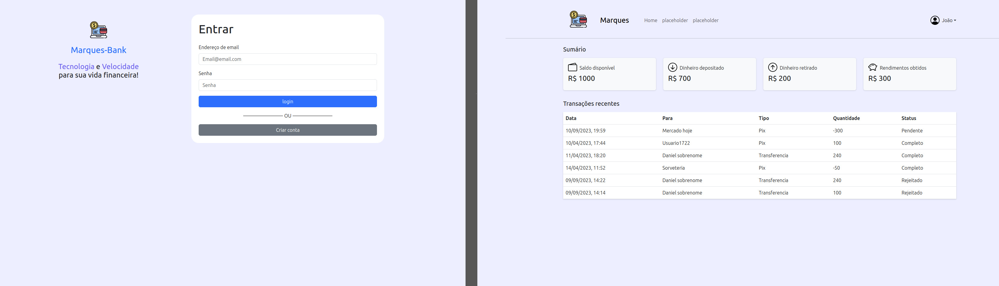

# Marques-bank



## Sobre
É um site front-end que vai simular um site de banco futuramente talvez irei trabalhar na parte do back-end

## Porque?
Treinar meu front-end e colocar no meu portifólio

## 🚀 Instalação do projeto
<details>
  <summary>Instalação e execução</summary>
  
  #### 1 - Clone o repositório
  - Use o comando ```git clone git@github.com:JoaoVMarques/marques-bank.git```
  - Entre na pasta ```cd marques-bank```
  
  #### 2 - Instalar as dependencias
  - Para instalar as dependencias ```npm install```

  #### 3 - Inicie o projeto
  - Para iniciar o projeto ```npm run dev```

</details>

## 📁 Utilizando o site
<details>
  <summary><strong>Login</strong></summary>
  
  Para fazer login no site utilize a conta:
  ```
  email: teste@email.com
  senha: 1234
  ```
</details>

<details>
  <summary><strong>Criar conta</strong></summary>
  
  Caso queira criar uma conta é simples, basta apertar no botão de "Criar conta" ou adicionar a rota ```/register```
</details>

## Parte Tecnica
<details>
  <summary><strong>🛠️ Ferramentas Utilizadas</strong></summary><br />
  - [VsCode](https://code.visualstudio.com/) Editor de codigo fonte
  - [Vite](https://vitejs.dev/) Montar o projeto
  - [FreeLogo Design](https://pt.freelogodesign.org/) logos
</details>

<details>
  <summary><strong>🧰 Dependencias</strong></summary><br />
  - Todas as dependencias estão dentro de ```dev-requirements.txt```
  - [React Bootstrap](https://react-bootstrap.netlify.app/) Estilização
  - [Vitest](https://vitest.dev/) Testes
  - [Linter](https://eslint.org/) Linter 
  - [React Router](https://reactrouter.com/en/main) Rotas
  - [Formik](https://formik.org/) Validar formulários
  - [Yup](https://www.npmjs.com/package/yup) schema da validação de formulário
  - [coverage](https://vitest.dev/guide/coverage.html) testar cobertura de testes
</details>
